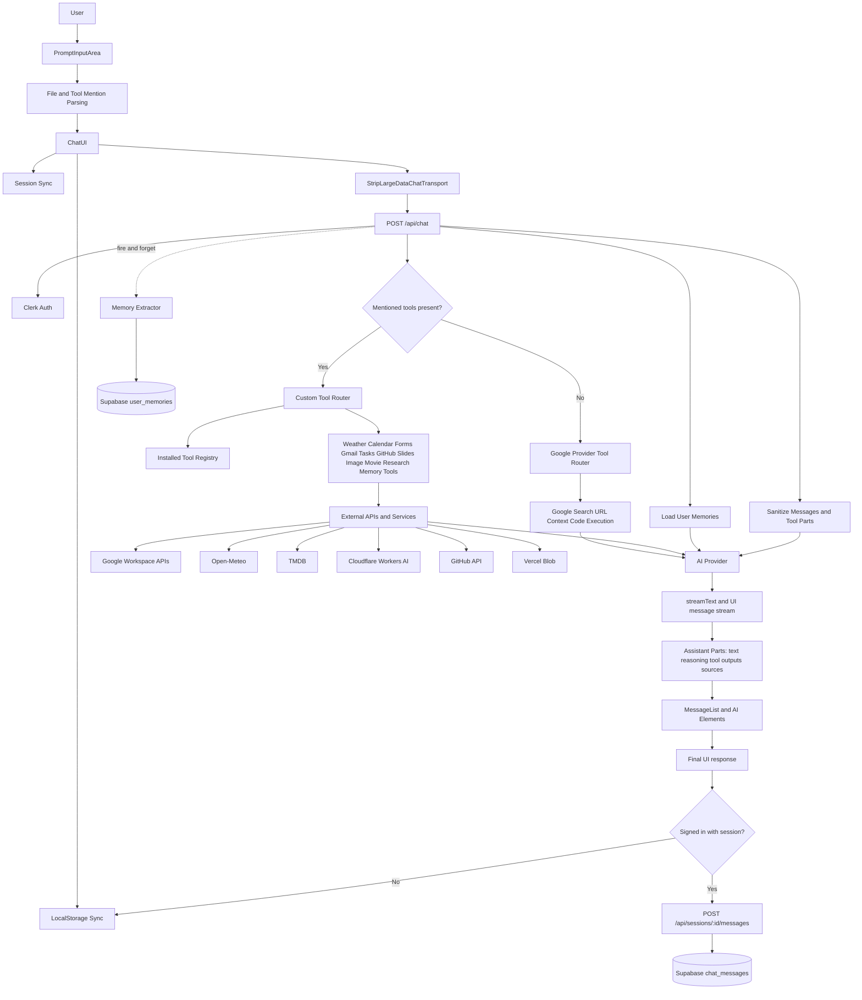
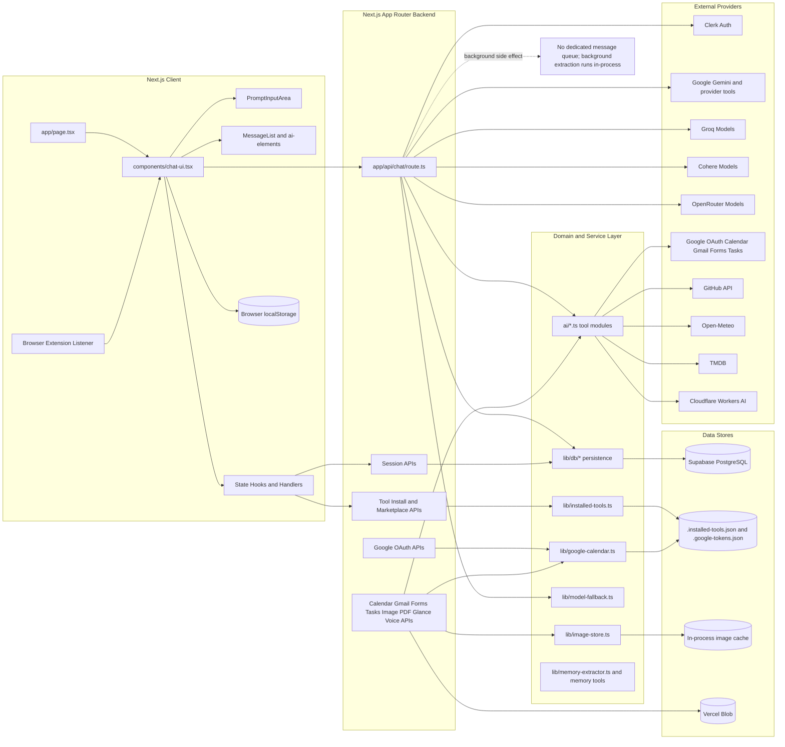
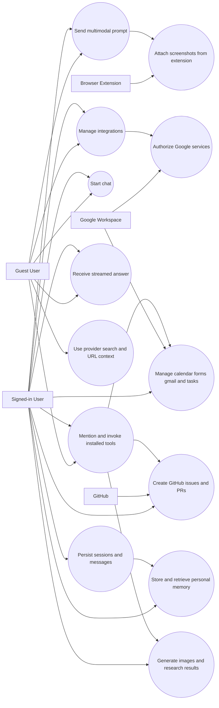
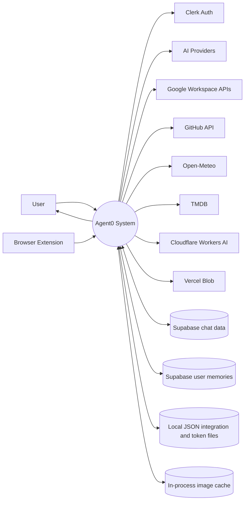
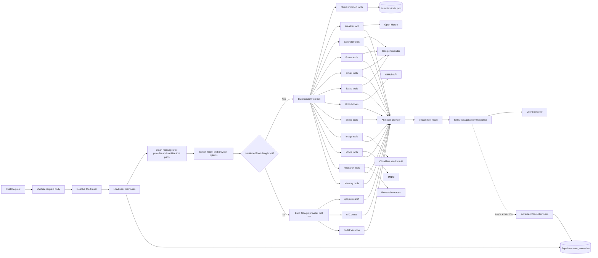
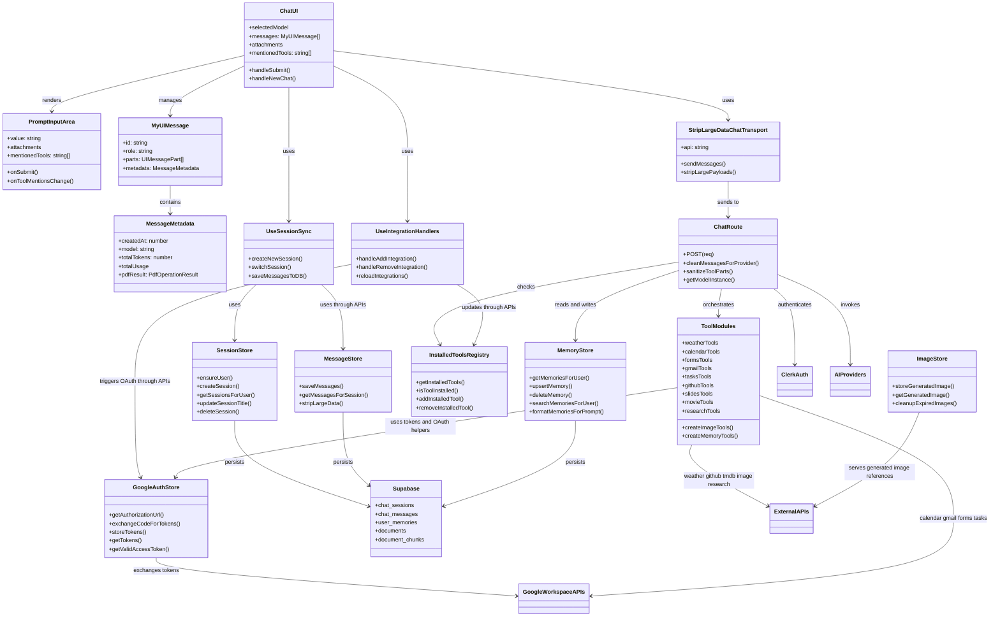

```mermaid
flowchart TD
    U[User] --> UI[ChatUI]
    UI --> PREFS[(localStorage)]
    UI --> INPUT[PromptInputArea]
    INPUT --> PARSE[Parse text files and @tool mentions]
    PARSE --> SEND[sendMessage via useChat]
    SEND --> CHATAPI[POST /api/chat]

    U --> AUTH[Sign in with Clerk]
    AUTH --> UI

    UI --> NEWSESSION{Signed in?}
    NEWSESSION -->|Yes| S1[POST /api/sessions]
    S1 --> SDB[(Supabase chat_sessions)]
    UI --> LOADSESSION[GET /api/sessions and /messages]
    LOADSESSION --> SDB
    LOADSESSION --> MDB[(Supabase chat_messages)]

    CHATAPI --> STREAM[Stream assistant response]
    STREAM --> UI
    UI --> RENDER[Render text reasoning sources and tool cards]
    RENDER --> U

    UI --> SAVE{AI turn finished and signed in?}
    SAVE -->|Yes| SAVEMSG[POST /api/sessions/:id/messages]
    SAVEMSG --> MDB
    SAVE -->|No| PREFS

    UI --> INTEG[Install or remove integrations]
    INTEG --> TOOLAPI[/api/tools/install]
    INTEG --> OAUTH[/api/auth/google]
    OAUTH --> GOOGLE[Google OAuth Consent]
    GOOGLE --> CALLBACK[/api/auth/google/callback]
    CALLBACK --> TOKENS[(.google-tokens.json)]

    EXT[Browser Extension] --> SCREEN[Send screenshot or page context]
    SCREEN --> UI
```



